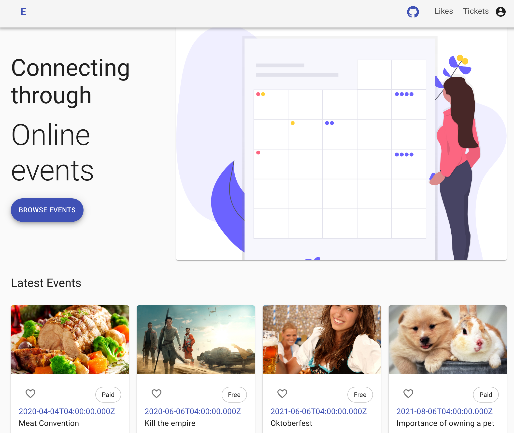
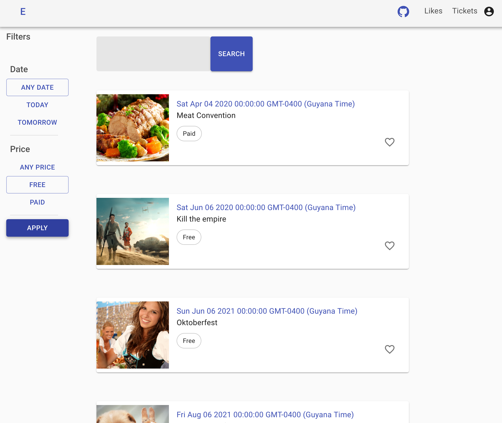
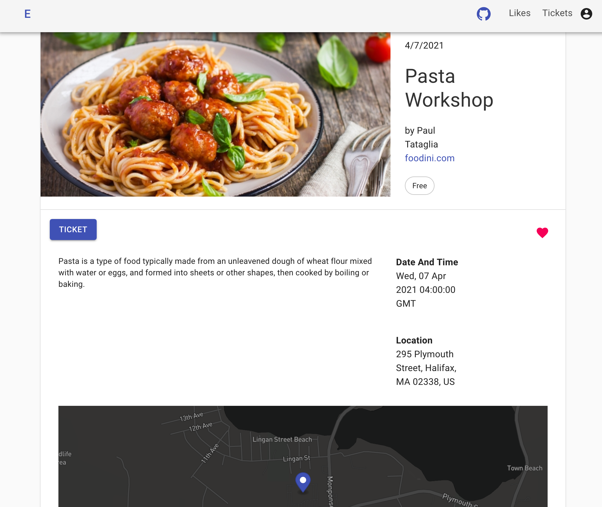

<h1 align="center">Welcome to proj-event-app 👋</h1>
<p>
  
  <a href="https://github.com/vlari/Proj-Event-App#readme" target="_blank">
    
  </a>
</p>

> Event app using MERN stack

### 🏠 [Homepage](https://github.com/vlari/Proj-Event-App#readme)

## Description

This is an Eventbrite clone app with some of the relevant features of that platform such as searching and filtering events, create an account, save events, event order list and purchase an event.

## Screenshots








## Install

```sh
npm install
```

## Run Project

```
npm run dev
```

## Author

👤 **vlari**

* Github: [@vlari](https://github.com/vlari)

## Show your support

Give a ⭐️ if this project helped you!

## 📝 License

Copyright © 2020 [obed](https://github.com/vlari).<br />
This project is [ISC](https://github.com/vlari/Proj-Event-App/blob/master/LICENSE) licensed.

***